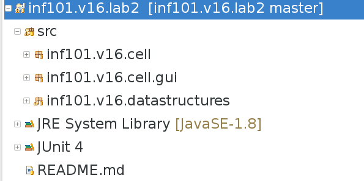

Lab 2: Celle-automater
===

## Læringsmål

* Bli kjent med `interface` (grensesnitt)
* Lage klasser som implementerer interface / grensesnitt
* Lage egne datastrukturer / ADTer

## Om oppgaven

Lab-oppgavene denne uken handler om cellemaskiner.

En cellemaskin består av et sett med celler, og hver celle har en tilstand. I
begynnelsen har hver celle en starttilstand, dette kaller vi generasjon 0. Så
lager maskinen en ny generasjon med celletilstander ifølge en fast regel. Når
alle cellene har fått en ny tilstand (generasjon 1) så fortsetter maskinen å
lage enda en ny generasjon ved igjen å følge de faste reglene. Slik fortsetter
maskinen så lenge vi ønsker.

Disse maskinene har blitt studert siden 1940-tallet, men ble berømt da
[Conway's Game of Life](https://en.wikipedia.org/wiki/Conway%27s_Game_of_Life),
den mest kjente cellemaskinen, ble oppfunnet på 1970-tallet. Kanskje det mest
interessante med cellemaskiner er hvor komplekse strukterer som kan oppstå ved
hjelp av veldig enkle regler.

Vi kjører cellemaskiner på et todimensjonalt brett som viser én og én generasjon fortløpende over tid.
Under vises cellemaskinen kalt Conway's Game Of Life:


I game of life har cellene to mulige tilstander: levende eller død. En levende
celle dør hvis den har færre enn 2 naboer eller mer enn 3 naboer. Derimot hvis
en død celle har nøyaktig 2 naboer så blir cellen levende. Ideen bak spillet er
å modelere overpopulasjon, underpopulasjon og reprodusering. Både vertikale,
horisontale og diagonale celler er naboer, som vist i bildet under:


Over er alle røde celler nabo til den blå cellen.

En av pioneerene for denne typen cellemaskiner var [John von
Neumann](https://en.wikipedia.org/wiki/John_von_Neumann). Han var interessert i
om ikke disse maskinene kunne produsere ikke bare seg selv (reprodusering), men
en hvilken som helst annen konstruksjon en skulle trenge.  Under er bilde av en
von Neumann cellemaskin som gjør akkurat det. Den bruker hele 29 forskjellige
celletilstander og nok regler til å fylle et par a4 sider.


# Steg 0: Gjør ferdig forrige oppgave

Laboppgavene bør gjøres i rekkefølge, som om du ikke er helt ferdig med den forrige, gjør den ferdig først.

# Steg 1: Hent Oppgaven fra git

Som før skal du ha et repository for oppgaven på retting.ii.uib.no. Se [Hvordan hente og levere oppgaver](https://retting.ii.uib.no/inf101/inf101.v19/wikis/hente-levere-oppgaver) for mer informasjon og instrukser. Oppgaven skal dere kunne finne i
repositoriet med den følgende urien:

    https://retting.ii.uib.no/<brukernavn>/inf101.v19.lab2.git

Hvor `<brukernavn>` skal byttes ut med brukernavnet ditt på retting.ii.uib.no.
Merk at det er nødvendig å bruke https (ssh vil ikke fungere).

Som vist i forelesningene, for å få dette prosjektet inn i eclipse, velg
`import` fra fil menyen.  Velg så `Git` -> `Projects from git` -> `Clone URI`.
Fyll in URIen som du finner over. (Eclipse fyller så ut *host* og *repository
path* med `retting.ii.uib.no` og `/<brukernavn>/inf101.v19.lab2.git`.

Skriv inn ditt brukernavnet og GitLab-passord, og trykk `next`. Nå velger du hvilken
branch du skal ha (`master` og `clear`). Trykk på `next`. Neste ting er å velge en mappe å
putte repositoriet under `Directory`, og la resten være slik det er (initial
branch: `master`, Remote name: `origin`), `next` -> `import existing project`
-> `next` -> `finish`.

Nå skal du ha et prosjekt i eclipse som heter `inf101.v19.lab2`.

Merk at innlevering skal skje til dette repositoriet. For å levere bruker du
`Team` -> `Push` (husk at du må bruke `commit` først), eventuelt `Team` ->
`Commit` og så `Commit and Push`. *Husk* at hvis du har opprettet nye
klasser/filer, må du krysse av for disse i commit-dialogen for at de skal bli
med i opplastingen. *Sjekk kvitteringssiden som kommer opp når du pusher, i
tilfelle det skjer feil!*

Vi anbefaler at du gjør commit hver dag, eller hver gang du er ferdig med en
større endring. Da går det alltid an å lete seg tilbake i historien til en
tidligere versjon hvis du har havnet på villspor (commit-dialogen inneholder
også en praktisk "Commit and push"-knapp, som pusher endringene til GitLab med
en gang).

# Oversikt over koden

Koden kommer med [Game of Life](https://en.wikipedia.org/wiki/Conway%27s_Game_of_Life)
allerede. Senere skal vi utvide programmet slik at det også kan vise en annen
cellemaskin kalt [Brian's Brain](https://en.wikipedia.org/wiki/Brian%27s_Brain).
Et eksempel på kjøringen av denne er under.


I denne maskinen har hver celle 3 mulige tilstand, levende, død, og døende.
Livet går sin vanlige gang: levende blir døende, døende blir døde, og hvis det
er nøyaktig to levende naboer lager de en liten krabat, men da må det være
plass (ingen levende eller døende i midten).

Vi skal først gjøre ferdig noen av klassene, slik at vi kan se at Game of Life
fungerer, og så skal vi implementere Brian's Brain.

# Pakker og Package Explorer

Større Java-prosjekter er organisert i *packages*. Det gjelder også koden dere
får utlevert. Du finner pakkene i `src`-mappen i Eclipse-prosjektet. Du er
denne gangen bare interessert i det som ligger i `inf101.v19.cell` og
`inf101.v19.datastructures`:



Du kan, om du vil, få Eclipse sin Package Explorer til å vise oversikten
hierarkisk og ikke flat (som over). Anya synes det er mest praktisk, særlig for
store prosjekter. Du kan justere dette i den lille menyen du finner under
trekanten øverst i Package Explorer:


Velg *Package Presentation → Hierarchical*.

# Steg 2: IGrid og MyGrid 

Vi trenger å kunne holde rede på en todimensjonal brett av celletilstander – et
*grid*. Dette kunne vi gjort med en array, eller evt en array av arrays, men
det er best å lage en egen klasse for dette, slik at vi er uavhengige av
hvordan dataene er lagret – den delen av programmet som håndterer
celleautomater skal ikke trenge å være avhengig av hvilken løsning vi har valgt
for å lagre todimensjonale data:

* Objekter som bruker grid må vite *hva* metodene gjør og hvordan de brukes, men trenger ikke bry seg om *hvordan* de er implementert.
* Bare implementasjonen av grid trenger å vite hvordan dataene er lagret og hvordan de hentes/oppdateres.

## Grensesnitt / Interface
I likhet med en klasse, er et *interface* eller *grensesnitt* noe som beskriver hvilke metoder et objekt skal ha – men, i motsetning til klasser, sier grensesnittet ikke noe om hvordan metodene er implementert eller hvilke feltvariabler et objekt skal ha. Dvs.:

* **Objekter:** Et objekt har tilstand og oppførsel, og består av feltvariabler (data) og et sett med metoder (kode) som implementerer oppførsel og lar oss observere og manipulere tilstanden.
* **Implementasjon av objekter:** En klasse definerer datastruktur og metoder til objekter – det er en oppskrift på hvordan man lager objekter. Hvert objekt er en *instans* av en klasse, og har feltvariablene og metodene som er beskrevet i klassen. Feltvariablene og koden er *innkapslet*, slik at andre deler av programmet vårt ikke trenger (eller har lov til) å forholde seg til detaljene. Dvs. at vi kan samle all kode som er avhengig av feltvariablene i samme `.java`-fil. 
* **Bruk av objekter:** Både klasser og grensesnitt er *typer* og beskriver hvordan objekter kan brukes – hvilke variabler de kan lagres i ("alle objekter av klassen Duck kan lagres i en variabel av typen Duck"), og hvilke metoder man kan kalle ("alle Duck-objekter har en quack()-metode, så hvis jeg har et Duck-objekt, kan jeg kalle quack()-metoden").
   * Hvert objekt kan passe sammen med flere typer – f.eks. kan alle objekter lagres i en variabel av typen `Object`.
   * Vi kan si at en klasse C implementerer et grensesnitt I (`C implements I`) – da krever vi at alle metodene i grensesnittet er implementert i klassen, og vi sier at det er OK å putte et `C`-objekt i en `I`-variabel: `I var = new C();`.
   * Hvis en variabel har en grensesnitt type (som `I var` over), så kan du kalle/bruke bare metodene som er definert i grensesnittet.
   * Du kan tenke på et grensesnitt som en spesifikasjon eller sett med krav til hva en klasse må inneholde – og som en oppskrift på hvordan du kan bruke objektene etterpå. Ofte vil vi sørge for at grensesnittet inneholder all nødvendig dokumentasjon for bruk..

Vi skal jobbe ganske mye med grensesnitt i løpet av INF101 – dette er bare en første introduksjon. Det er særlig to typer bruk vi støter på til å begynne med:

* Dere får utdelt et grensesnitt i en oppgave, og så skal dere lage en klasse som implementerer det. I dette tilfelle er grensesnittet ca. som en klasse uten feltvariabler og med `// TODO` i hver variabel – rett og slett bare oppskriften på hva du skal implementere.
* I tilfeller hvor vi har flere typer objekter som skal ha forskjellig oppførsel, men fremdeles kunne brukes på samme måte. F.eks. at vi vil kunne ha både ender, fisker, frosker og vannliljer i en andedam. 


## Grid Interface

Vi har laget et grensesnitt
[IGrid](https://retting.ii.uib.no/inf101.v19.oppgaver/inf101.v19.lab2/blob/master/src/inf101/v19/datastructures/IGrid.java)
som inneholder metodene vi er interessert å bruke på brett. For denne oppgaven skal IGrid håndtere tilstanden
til en Celle, altså en `CellState`, men i en nyere oppgave skal vi oppdatere MyGrid sånn at den kan lagre alle
slags data. IGrid
har følgende metoder:

    public interface IGrid {
        int getHeight();  // returner høyden
        int getWidth();   // returner bredden
        void set(int x, int y, CellState element); // sett elemenetet på x,y til element
        CellState get(int x, int y); // hent elementet på x,y
        IGrid copy();  // returner en kopi av brettet
    }

IGrid er ment å fungere liknende til en flerdimensjonal array, men er litt annerledes i bruk. F.eks. vil `grid.set(x, y, DEAD)` svare til `grid[x][y] = DEAD`.

## Steg 2.1: Gjør ferdig implementasjon av `MyGrid implements IGrid`

Du skal nå gjøre ferdig en implementasjon av IGrid. Heldigvis har vi begynt på jobben allerede :)

* Åpne filene [IGrid.java](https://retting.ii.uib.no/inf101.v19.oppgaver/inf101.v19.lab2/blob/master/src/inf101/v19/datastructures/IGrid.java)
  og [MyGrid.java](https://retting.ii.uib.no/inf101.v19.oppgaver/inf101.v19.lab2/blob/master/src/inf101/v19/datastructures/MyGrid.java)
  i Eclipse (du finner dem i `src/inf101/v19/datastructures/`). Les
  dokumentasjonen til metodene i IGrid.
* Legg merke til `implements IGrid` øverst i MyGrid.java – dette betyr at MyGrid skal implementere IGrid. Klassen må ha kode for alle metodene i IGrid, og alle grid-objekter (laget med `new MyGrid(...)`) kan brukes som beskrevet i IGrid (med `get`, `set` osv).
* I klassen som følger med oppgaven har vi lagt til noen feltvariabler. Du står
  fritt til å gjøre andre valg om du vil.
    * Vi har brukt `IList` (grensesnitt) og `MyList` (implementasjon av
      `IList` til å lagre elementene – Her kan man evt bruke `List` og
      `ArrayList` som følger med i Java. Se dokumentasjon i IList for hvordan denne brukes. Du er antakelig interessert i metodene `add`, `set` og `get`.
    * Du *kan* bruke en vanlig array/tabell, `CellState[]` – men senere i 
      kurset kommer vi til å unngå vanlige arrays for å kunne lage *generiske*
      klasser.
* Konstruktøren er allerede ferdig skrevet. Legg merke til at både IList/MyList
  og List/ArrayList starter som helt tomme – i motsetning til en array, som har
  et fast antall elementer som alle er satt til `null` til å begynne med.
  Derfor bruker vi `add` i konstruktøren for å legge til det antallet elementer
  vi trenger.
* Fyll inn getHeight() og getWidth()
* For `set` og `get` må vi finne ut hvordan vi skal konvertere mellom (x,y)
  koordinater og indekser i en endimensjonal liste. En grei løsning er f.eks.
  at *indeks = x + (width * y)* – det vil si at dataene ligger lagret etter
  hverandre i listen, rad for rad (hver rad er *width* lang). *Fyll inn kode
  som lagrer / henter elementer fra listen basert på x,y-koordinatene.*
* Den siste metoden, `copy()` er allerede ferdig.

## Steg 2.2: Test MyGrid

* Det følger med en klasse `GridTest`. Høyreklikk på denne, og kjør *Run as →
  JUnit Test*. Alle fire test casene skal virke. Hvis testen feiler, er det noe
  galt med `MyGrid.java`:
    * Hvis du har feil i `outOfBoundsTest()` har du antakelig fjernet
      argumentsjekkene fra `get` og `set`.
    * Hvis du har feil i en av `setGetTest1`/`2` eller `copyTest` har du
      antakelig enten ikke implementert både `get` og `set`, eller du har feil
      i oversetting mellom (x,y)-koordinater og listeindekser.
    * Hvis du får IndexOutOfBoundsException i `setGetTest1`/`2` har du
      antakelig feil i oversetting mellom (x,y)-koordinater og listeindekser.
* Fiks eventuelle problemer med MyGrid

## Steg 2.3: Lag noen flere tester

Lag noen nye testmetoder i `GridTest` etter samme mønster som de som er der fra
før. Hver testmetode skal være `public void` og ha `@Test` foran seg. Bruk
`assertEquals(forventet verdi, verdi)` for å se om en verdi er den samme som
forventet. Sjekk f.eks.:

  * getHeight() gir samme verdi som `MyGrid` ble konstruert med.
  * getWidth() gir samme verdi som `MyGrid` ble konstruert med.
  * Negative indekser, og for store indekser til `get()`/`set()`resulterer i `IndexOutOfBoundsException`. Se `outOfBoundsTest()` for et eksempel som tester for store indekser til `set()`.
  * Hva skjer om du lager et grid med høyde eller bredde lik 0? (Hva synes du burde skje?)

## Steg 2.4: Test testene...

Det er ikke så lett å lage gode tester:

* Endre `MyGrid` midlertidig slik at `set` *alltid* setter elementet på
  posisjon 0 i listen, og `get` alltid returnerer elementet på posisjon 0 i
  listen. Dvs. i stedet for å lagre et todimensjonalt brett, lagrer vi bare én
  eneste verdi – en oppførsel som er helt forskjellig fra hva vi opprinnelig
  har tenkt.
* Kjør `GridTest` en gang til. Virker alle eller de fleste av testene?
* Fiks `MyGrid` så den fungerer som normalt igjen.

Selv om vi skriver tester, kan alvorlige feil likevel slippe gjennom. Vi skal etterhvert lære bedre teknikker for å lage grundigere tester.

Steg 3: Kjør Game of Life
============

 I `Main` (`inf101.v19.cell.Main`) klassen finner du `main()`-metoden. Der ser du at det først oprettes
et `GameOfLife` objekt, så blir den gitt til `CellAutomataGUI` som håndterer
det grafiske grensesnittet.

 Det er kommentert ut en linje i `main()`-metoden der det istedenfor oprettes
et `BriansBrain` objekt. Når du har implementert `BriansBrain` kan du
istedenfor gi `CellAutomataGUI` et `BriansBrain` objekt, så vil
`CellAutomataGUI` vise det istedenfor.

`CellAutomataGUI` tar imot et objekt som implementerer `ICellAutomaton`, så det
er dette grensesnittet som `BriansBrain` også skal implementere. (Her ser du et tilfelle av at grenesnitt brukes til å la flere forskjellige ting brukes på samme måte – vi kan ha flere forskjellige celleautomater som lar seg kjøre fra samme GUI/meny-systemet.)

* Høyreklikk på `Main`, velg *Run as → Java Application*.
* Prøv ut programmet. Det skal se ca. slik ut:


Steg 4: Brian's Brain
==========

Nå er vi klar for `BriansBrain`. I store trekk vil klassen ligne veldig på 
`GameOfLife`. Det kan være lurt å ta utganspunkt i den klassen (copy/paste ...). `BriansBrain`
vil også implementere `ICellAutomaton` grensesnittet så det er lurt å sette
deg inn i hva grensesnittet består i. Siden `BriansBrain` har celler med tre mulige
tilstander kommer den til å trenge en egen `enum` for å holde styr på 
tilstanden til alle cellene – du kan bruke den vedlagte `CellState` som også blir brukt av `GameOfLife` (som bare bruke tilstandene `ALIVE` og `DEAD`):

```
public enum CellState {
	ALIVE,
	DYING,
	DEAD
}
```

Hvis du er litt usikker på hvordan `enum` fungerer kan du ta en titt [her](http://docs.oracle.com/javase/tutorial/java/javaOO/enum.html).

Steg 4.1
------
* Lag en ny klasse `BriansBrain implements ICellAutomaton`.
* Skriv konstruktøren for `BriansBrain`, og metodene `getHeight()` og `getWidth()`. Konstruktøren
burde lage et `MyGrid` som holder den nåværende generasjonen. Når du lager et
nytt `MyGrid` kan du oppgi f.eks. `CellState.DEAD` som initielt element til
alle cellene. `getHeight()` og `getWidth()` refererer til størrelsen på den
nåværende generasjonen.

Steg 4.2
------

* Skriv `initializeGeneration()` og `getColorInCurrentGeneration()`.
* `initializeGeneration()` gir en tilfeldig verdi til alle cellene i den
  nåværende generasjonen (bruk
  [Random](http://docs.oracle.com/javase/8/docs/api/java/util/Random.html) –
  f.eks. `CellState.ALIVE` hvis `random.nextBoolean()` er `true` og
  `CellState.DEAD` ellers), og
* `getColorInCurrentGeneration()`
skal fortelle det grafiske grensesnittet hvilken farge som cellen skal farges med. Her
kan du feks. bruke

   * `Color.white` for døde celler,
   * `Color.blue` for døende celler
   * og `Color.black` for levende celler.

Steg 4.3
------

Skriv `stepAutomata()`. Denne metoden oppdaterer generasjonen i `Grid` ved å anvende 
reglene for Brian's Brain. Husk:

  * Levende celler blir Døende.
  * Døende celler blir Døde.
  * Døde celler blir levende hvis den har nøyaktig to levende naboer.

Sjekk `GameOfLife.java` for tips om du trenger hjelp til å sjekke hvor mange levende naboer en celle har.

Steg 5: Kjør Brian's Brain
==========

Bytt ut `GameOfLife` objektet i `Main` klassen med et `BriansBrain` objekt.
Nå burde Brian's Brain kjøre når du trykker på "Run Automaton" knappen.

Steg 6: Commit & Push
===========
* Husk å *committe* endringene dine (gjerne underveis mens du jobber), og *pushe* til *retting.ii.uib.no*, slik du lærte i forrige lab.
* Hver gang du pusher kjører vi automatiske tester på koden din. Du kan se en oversikt over øvelsene og resultatene på http://retting.ii.uib.no:81/me (første gang må du godkjenne autentisering).
